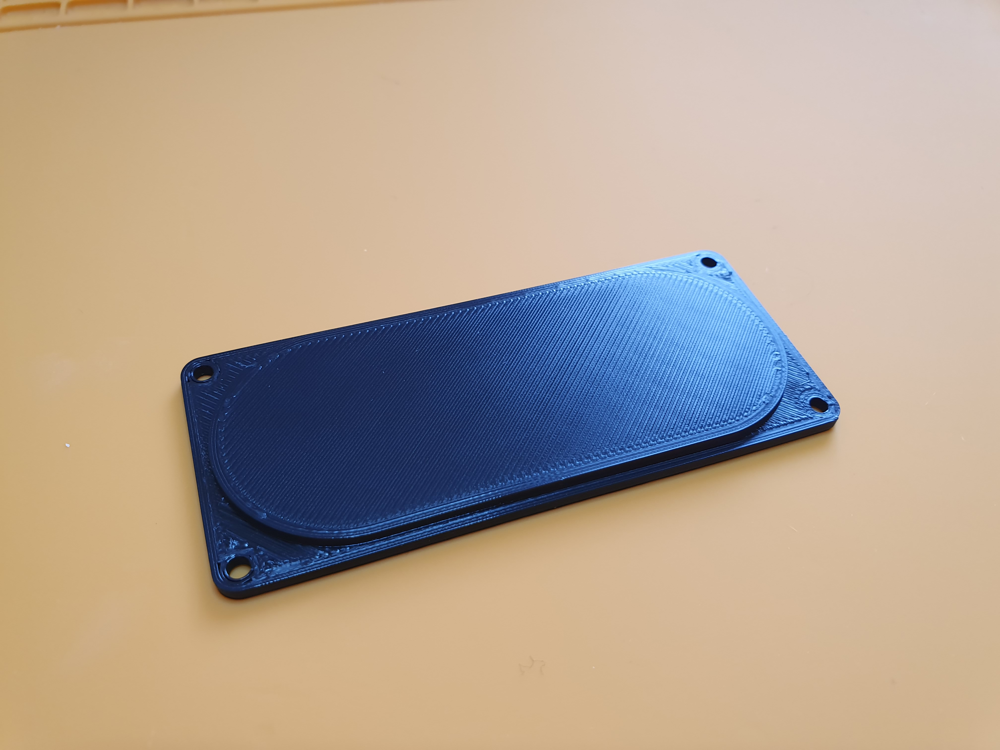

# Buchla Boat Cutout Cover

A 3D printable cover for the cutout in the bottom of Buchla boats made with Autodesk Fusion 360.

## Compatibility

I only checked the fit with boats made by [SAModular](https://www.samodular.com/), so far.

## How to print

The print settings are not that special. Others should work, too.

- Layer height: 0.2-0.3mm
- Nozzle diameter: 0.4mm

## Assembly Instructions

Put the cover into the cutout from the inside of the boat.
Fasten with 4 M3 6mm screws. The holes in the cover have a diameter of 2.8mm so an M3 screw will hold in it. Of course you can use longer screws an secure them with a nut.

## License

This work is licensed under a [Creative Commons Attribution-ShareAlike 4.0 International License](http://creativecommons.org/licenses/by-sa/4.0/)
